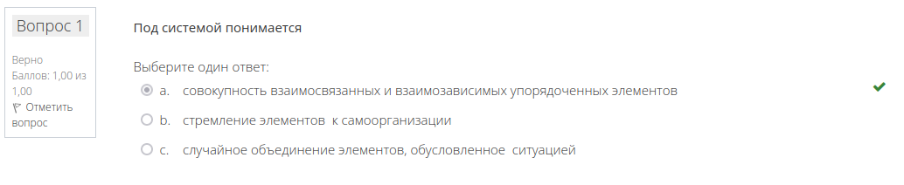
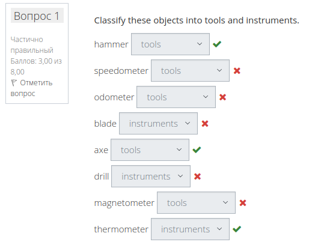
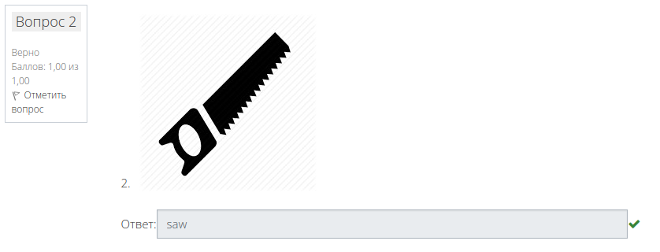

# LMSAnswerer
This prgoram solves LMS tests either randomly or based on JSON 

## Question types in LMS:
* `multichoice` with one correct answer:
	- example of question:
		> 
	- used for tests with at least one correct option
	- implement using `<input>` HTML tag that has type `radio`
* `gapselect`:
	- example of question:
		> 
	- used for questions with several (or one) dropdown menus
	- implemented using `<select>` HTML tag
* `shortanswer`:
	- example of question:
		> 
	- used for questions with short text answer, no choices
	- implemented using `<input>` HTML tag that type `text`